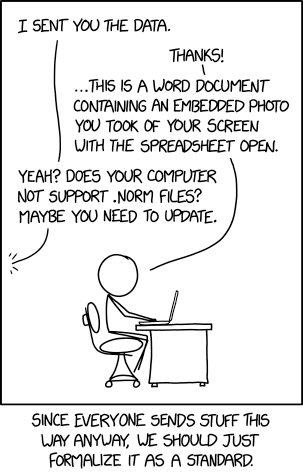

# Convert you data to the norm format

- Last modified: ons maj 25, 2022  04:16
- Sign: nylander

---

## File format `.norm`

1. Open the data in a spread sheet program,
2. take a screenshot of the opened window,
3. paste the screenshot in a MS Word document.
4. Change the file suffix to `.norm`

## The script (work in progress)

The current version attempts to open an infile with the user's preferred
application (according to file type), and then proceeds with steps 2--4 above.
Furthermore, the screenshot is taken of the whole desktop, and not only the
opened window.

## Installation

See file [INSTALL](INSTALL)

## Usage

Examples:

    ./src/tonorm data/infile.xlsx
    ./src/tonorm data/teddy.png
    ./src/tonorm data/text.txt

